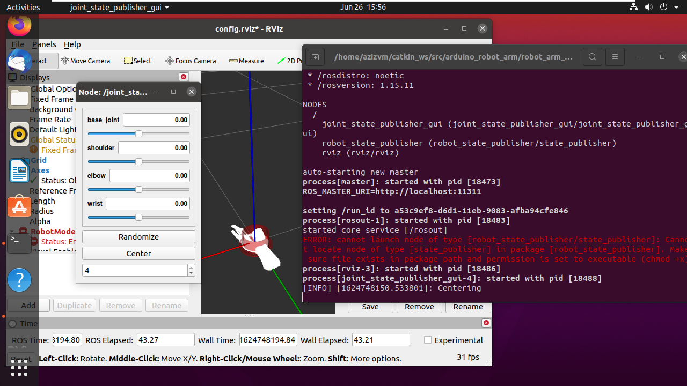

# arduino_robot_arm in ROS noetic

  This demo is prepared for the submission of the first AI task in the summer training offered by Smart Methods Co.

  It is concerned with preparing the required environment to run a robot arm simulation created by @smart-methods.
 
### Results
  Want to check the result? have a look at this link 
  ```
  https://drive.google.com/file/d/1h2L0IssogK2DOlL2nAsip2lZ_cnc5neY/view?usp=sharing
```
### Steps

  Following, are the detailed steps and fixes to run the arduino_robot_arm simulation on ubuntu 20.04 and ROS noetic in Rviz.

#### 1. Assuming ubuntu 20.04 is already running, install  ROS noetic by following this tutorial.
```
	http://wiki.ros.org/noetic/Installation/Ubuntu
```

#### 2. Create a workspace for catkin.
```
	http://wiki.ros.org/catkin/Tutorials/create_a_workspace
```

#### 3. Go ahead and clone the arduino_robot_arm package in the catkin_ws source files:
```
	$ cd ~/catkin_ws/src
	$ git clone https://github.com/smart-methods/arduino_robot_arm 
```

#### 4. It's important to install all the dependencies for ROS noetic instead of melodic or kinetic as follows:
```
	$ cd ~/catkin_ws
	$ rosdep install --from-paths src --ignore-src -r -y
	$ sudo apt-get install ros-noetic-moveit
	$ sudo apt-get install ros-noetic-joint-state-publisher ros-noetic-joint-state-publisher-gui
	$ sudo apt-get install ros-noetic-gazebo-ros-control joint-state-publisher
	$ sudo apt-get install ros-noetic-ros-controllers ros-noetic-ros-control
```

#### 5. When all the dependencies are downloaded, compile the package:
```
	$ cd ~/catkin_ws
	$ catkin_make
```
#### 6. To run the simulation using Rviz and control it by joint_state_publisher:
```
	$ roslaunch robot_arm_pkg check_motors.launch
```

#### 7. Follow this simple tutorial to fix the joint_state_publisher issue that appears in ROS noetic


