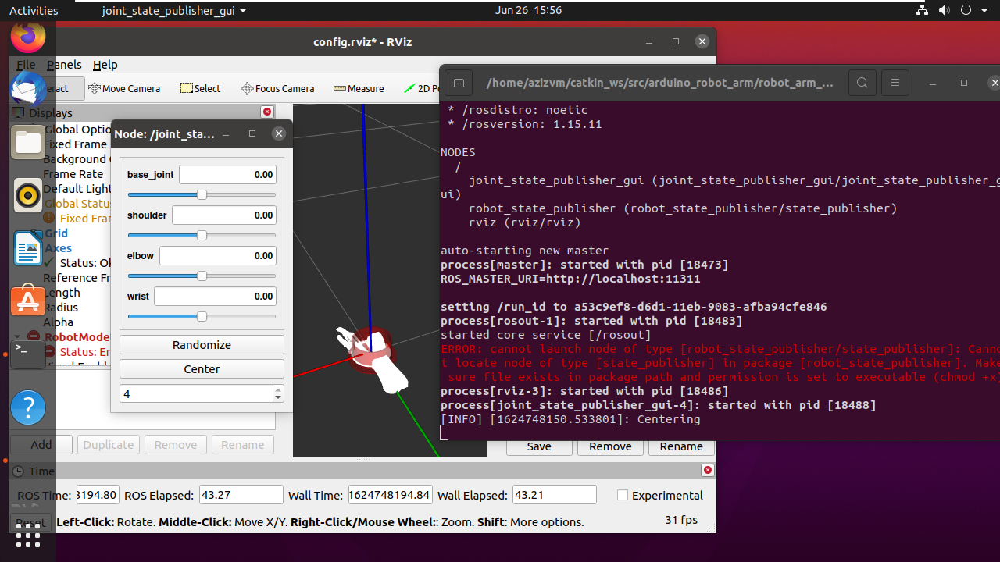
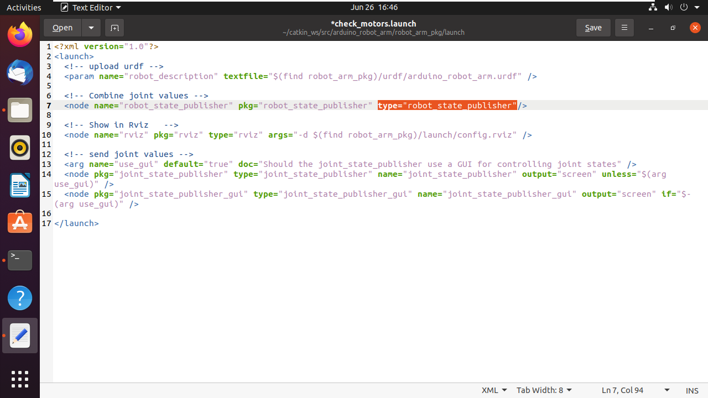

# joint_state_publisher in ROS noetic

## Overview
    ERROR: cannot launch node of type [robot_state_publisher/state_publisher]: Cannot locate node of type [state_publisher] in package [robot_state_publisher]. Make sure file exists in package path and permission is set to executable (chmod +x)
    
This problem is caused because "state_publisher" was an alias to the node "robot_state_publisher" that no longer exists in the source package https://github.com/ros/robot_state_publisher

## Fix

solving this issue is pretty simple, follow these steps to fix the problem

#### 1. Locate the launch file that contains a reference to "state_publisher", in this case it's the following path

    ~/catkin_ws/src/arduino_robot_arm/robot_arm_pkg/launch/check_motors.launch
    
#### 2. Edit the reference to the "state_publisher" in the launch file to "robot_state_publisher"

