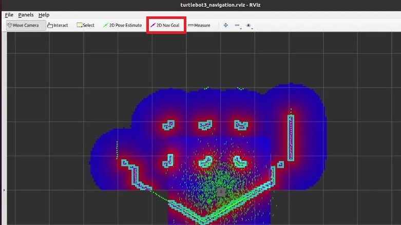
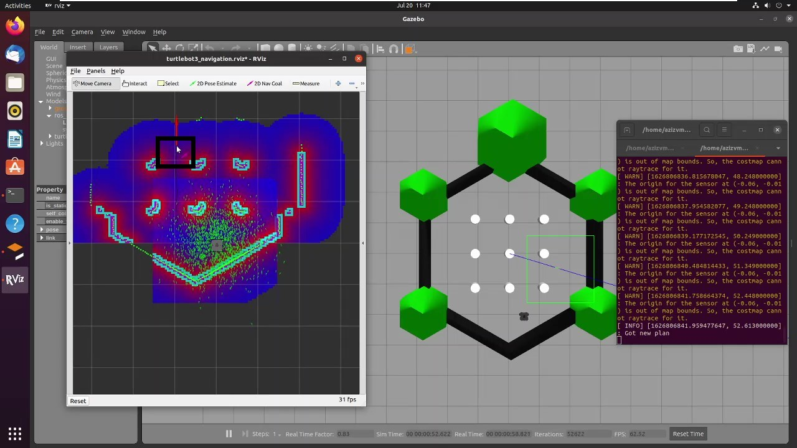
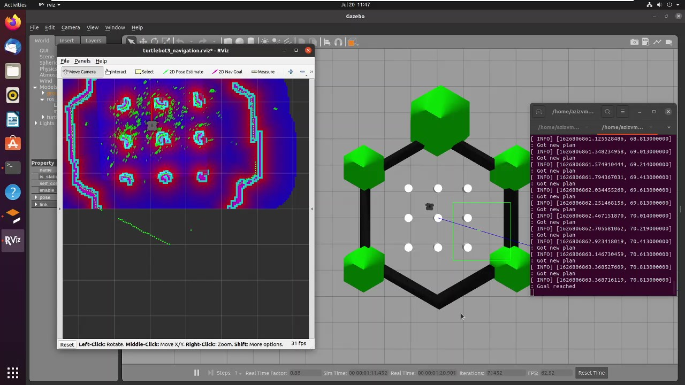

# Navigating through a SLAM map using Turtlebot3 on ROS noetic

## Overview

This demo is prepared for the submission of the fourth AI task in the summer training offered by Smart Methods Co.

It is concerned with navigating through a map created by SLAM using Turtlebot3 on ROS noetic.

## Steps

Following, are the steps to launch the turtlebot3_navigation file and navigate through a previously created map on ubuntu 20.04 and ROS noetic.

### 1. If the map is not already present, use this simple tutorial to create one. 
	https://github.com/0xazz/SM-training/tree/main/AI/task3

#### This is the map used in this tutorial

### 2. Run the turtlebot3_world.launch file with gazebo 
	$ export TURTLEBOT3_MODEL=waffle
	$ roslaunch turtlebot3_gazebo turtlebot3_world.launch
	
### 3. In a new terminal, launch the navigation launch file specifying the location of your map.
	$ export TURTLEBOT3_MODEL=waffle
	$ roslaunch turtlebot3_navigation turtlebot3_navigation.launch map_file:=$HOME/Desktop/map.yaml

### 4. Now, start the navigation using the panel in the top 

#### Press "2D Nav Goal" to set the goal

#### Now the goal is set and the robot will start determining the path and move respectively

### 7. The goal is reached!

#### check the video on this link
	https://drive.google.com/file/d/1YOEH8zzW5C7uqoEyx-poJx6BX40LYNtU/view?usp=sharing

